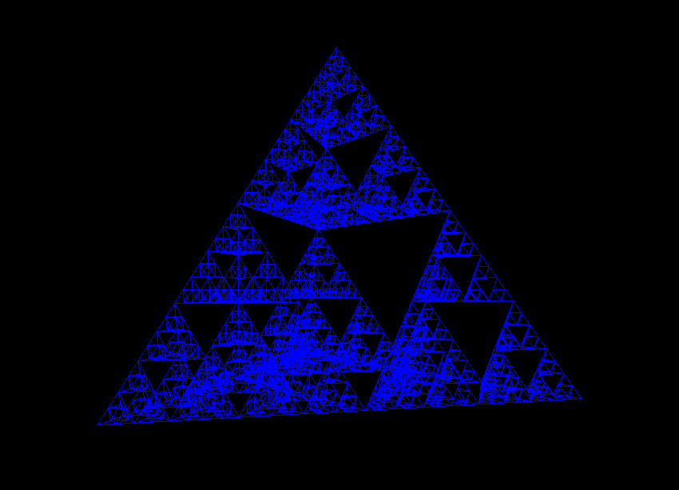

# 3d-sierpinski
Using ThreeJs library to generate and Ddisplay an interactive 3D sierpinski fractal.

## How to View
Example uses NodeJs to server Static Files.
Enter in to command prompt
```cmd
node server.js
```
Click and move the mouse to explore the shape.
Use Scroll wheel to zoom in/ out.

## Demo

